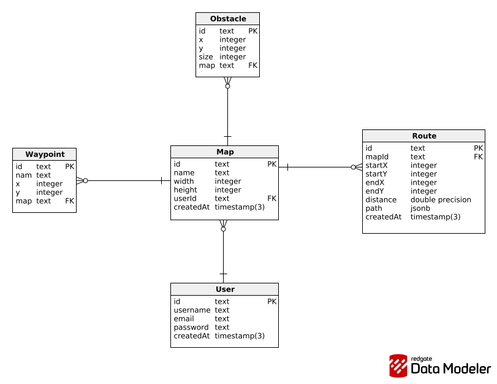

# LYNX - PATH FINDER

## Estructura del proyecto

Se esta utilizando una arquitectura de 3 capas:

```
   src
    ├── app.js
    ├── application
    │   └── services
    │       ├── mapService.js
    │       ├── obstacleService.js
    │       ├── routeService.js
    │       ├── userService.js
    │       └── waypointService.js
    ├── infrastructure
    │   ├── prisma.js
    │   └── repositories
    │       ├── mapRepository.js
    │       ├── obstacleRepository.js
    │       ├── routeRepository.js
    │       ├── userRepository.js
    │       └── waypointRepository.js
    ├── middlewares
    ├── presentation
    │   ├── controllers
    │   │   ├── mapsController.js
    │   │   ├── obstacleController.js
    │   │   ├── routeController.js
    │   │   ├── userController.js
    │   │   └── waypointController.js
    │   └── routes
    │       ├── mapRoutes.js
    │       ├── obstacleRoutes.js
    │       ├── routeRoutes.js
    │       ├── userRoutes.js
    │       └── waypointRoutes.js
    ├── server.js
    ├── tests
    └── utils
```

## Base de datos



## Inicializar el proyecto

```bash
npm init -y
```

## Herraminetas necesarias:

### Express:

```bash
npm install express
```
### Dotenv

```bash
npm install dotenv
```

### Base de datos (PostgreSQL):
```bash
npm install pg pg-hstore
```

### Prisma ORM:
Instalacion:

Instalar el CLI de Prisma como dependencia de desarrollo
```bash
npm install -D prisma
```

Instalar el Cliente de Prisma como dependencia de producción
```bash
npm install @prisma/client
```

Inicializar prisma:
```bash
npx prisma init
```

Generar tablas en el contenedor PostgreSQL:
```bash
npx prisma migrate dev --name init_db
```

Generar el Cliente:
```bash
npx prisma generate
```

Inicializar prisma studio:
```bash
npx prisma studio
```

Si la base de datos ya existe solo se debe realizar la generacion del cliente y posteriormente actualizar la base de datos a la estrcutura que ya definimos:

```bash
npx prisma db push
```
### Testing

```bash
npm install --save-dev jest @jest/globals
```


